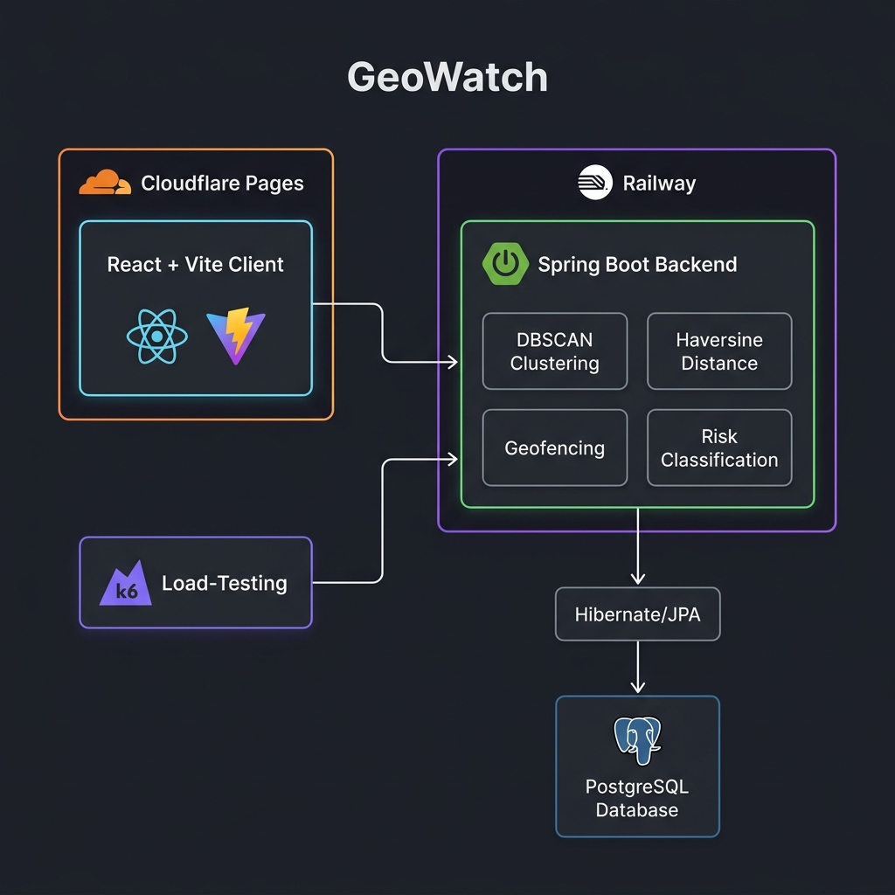
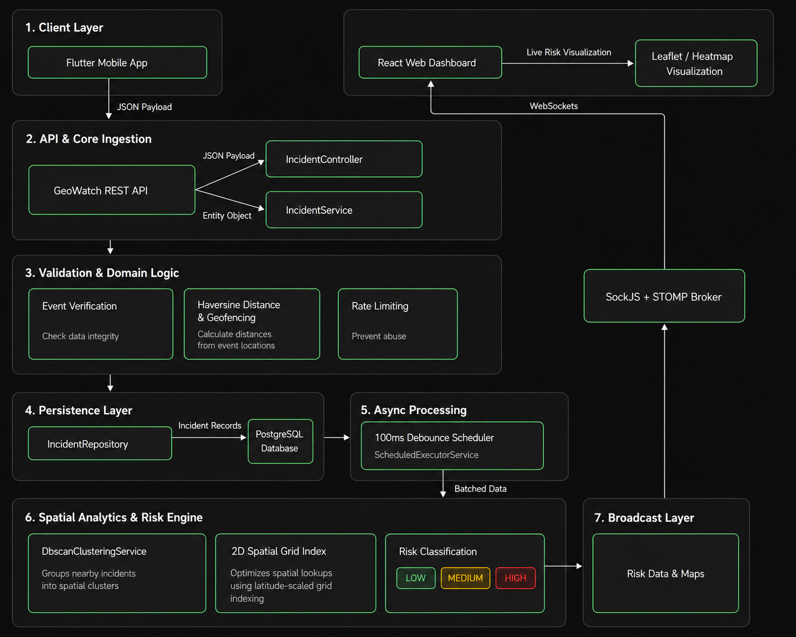
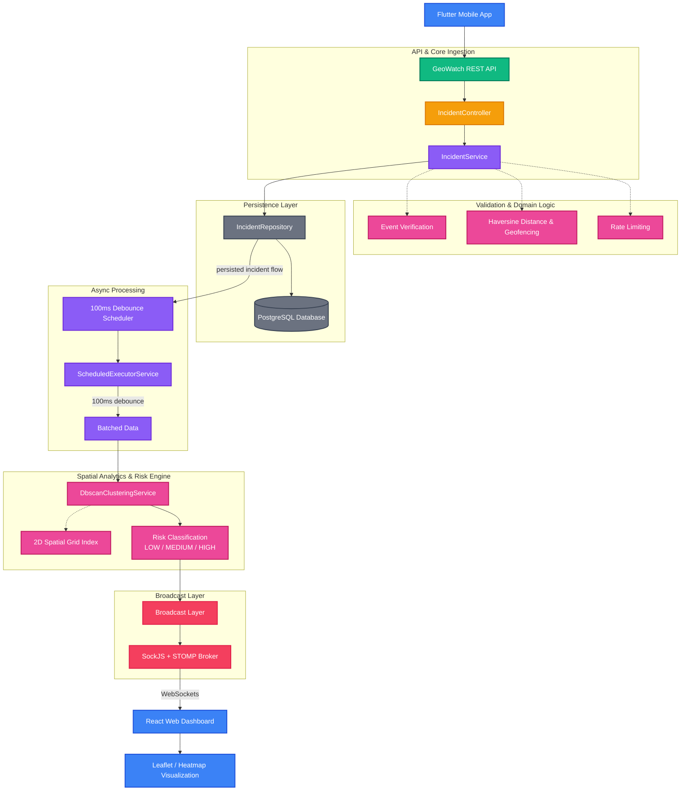

# GeoWatch – System Architecture & Implementation Documentation

This document provides a comprehensive, production-grade architecture review and technical analysis of **GeoWatch**, a geospatial crowd safety and real-time incident monitoring platform. It serves as a complete reference for software engineers to understand the system design, request lifecycles, component boundaries, data models, and performance characteristics without needing to inspect the raw source code.

---

## 1. Architecture Overview

GeoWatch is built as a decoupled, multi-component system designed for rapid incident ingestion and low-latency client broadcasts. Mobile clients dynamically report incident locations, which are verified, rate-limited, and persisted. An asynchronous processing pipeline aggregates these incidents using density-based clustering to map active safety risk zones in real time, pushing instant visualization updates to web monitoring dashboards.

The architecture comprises:
* **Mobile Ingestion Client (Flutter)**: Allows participants to submit geo-tagged incident reports.
* **Web Monitoring Dashboard (React + Vite)**: Renders live geospatial heatmaps and event cluster markers.
* **Backend Processing Engine (Spring Boot)**: Manages rate-limiting, geofence boundary checks, spatial clustering algorithms, and updates broadcast.
* **Relational Persistence Layer (PostgreSQL & Hibernate/JPA)**: Stores core system records with composite indexing optimized for fast reads.

---

## 2. System / Deployment Architecture

The following diagram illustrates the deployment topology, infrastructure boundaries, and major physical components of the GeoWatch system:



### Core Deployment Boundaries
* **Cloudflare Pages**: Hosts the statically compiled and optimized React + Vite web dashboard. This global edge network ensures low-latency delivery of the frontend bundle.
* **Railway Cloud**: Deploys the Spring Boot backend processing application and hosts the managed PostgreSQL relational database.
* **k6 Testing Component**: Positioned separately as a traffic-generation mechanism targeting the public-facing Railway API endpoints, validating scalability and system throughput under simulated load.

---

## 3. Processing & Data Flow

The following diagram illustrates the internal processing pipeline and data flow inside GeoWatch, mapping each system component to its runtime responsibility from ingestion to visual dashboard rendering:



### Editable Processing Pipeline

The following Mermaid diagram provides an editable representation of the GeoWatch processing pipeline shown above.



---

## 4. Component Responsibilities

* **`IncidentController`**: Ingests incoming incident HTTP reports and handles request validations (e.g. non-null coordinates, non-blank phone numbers).
* **`IncidentService`**: Coordinates core operations. It handles event validity validation, executes geofence and rate-limiter logic, writes records to persistence, and manages the debounced background processing scheduler.
* **`DbscanClusteringService`**: Runs the custom DBSCAN algorithm over unresolved geospatial incidents using a 2D spatial grid index for fast coordinate grouping.
* **`MetricsService`**: Profiles database query speeds, WebSocket connection counts, calculation execution times, and stores telemetry indicators.
* **`MetricsProxyDataSource`**: Native dynamic connection proxy tracking Hikari database pool operations to intercept SQL commands and profile slow queries.

---

## 5. REST Communication

Normal operations, configurations, and incident reporting flow over typical REST endpoints:
* `POST /api/incidents`: Triggered by mobile clients to report safety incidents.
* `POST /api/admin/login`: Administrator session authorization.
* `GET /api/admin/metrics`: Returns application telemetry, database latency distributions, and N+1 query warnings.
* `GET /api/events/nearby`: Allows mobile clients to dynamically retrieve nearby events based on client location coordinates.

---

## 6. Real-Time Communication

GeoWatch uses real-time WebSockets to update client monitoring dashboards without polling overhead.

* **Protocol**: SockJS + STOMP (Streaming Text Oriented Messaging Protocol).
* **Configured Broker Endpoint**: `/ws` (supports fallback mechanisms for environments blocking raw WebSocket connections).
* **Broadcast Topic**: `/topic/risk-updates/{eventId}`.
* **Payload Structure**: Broadcasters serialize calculations into JSON-based coordinate arrays:
  ```json
  [
    {
      "centerLat": 12.9716,
      "centerLng": 77.5946,
      "incidentCount": 4,
      "riskLevel": "MEDIUM"
    }
  ]
  ```

---

## 7. GeoWatch Processing Pipeline

The backend implements custom algorithms to parse raw coordinates into risk categories:

### 1. Geofence Boundary Check
Computes distance from incident to the event center coordinates using the **Haversine formula**:
$$d = 2R \arcsin\left(\sqrt{\sin^2\left(\frac{\Delta\phi}{2}\right) + \cos(\phi_1)\cos(\phi_2)\sin^2\left(\frac{\Delta\lambda}{2}\right)}\right)$$
The submission is validated if it falls within the event's radius with a 30-meter tolerance buffer:
$$\text{Distance} \le \text{Event Radius} + 30\text{m}$$

### 2. Rate Limiting
Queries relational storage to check past submissions. If the same phone number submitted $\ge 3$ incidents within the last 5 minutes, the request is rejected to prevent denial-of-service spam.

### 3. Spatial Grid Indexing & DBSCAN Clustering
Instead of using expensive $O(N^2)$ pairwise distance scans, coordinates are mapped into a 2D grid index of size $\epsilon$ (50m).
* **Bangalore Approximation**: The grid boundary calculation uses a hardcoded latitude cosine constant for Bangalore, India (`12.9716`) to bypass expensive dynamic runtime trigonometric calculations:
  $$\Delta\text{Lon} = \frac{\epsilon}{111,320.0 \times \cos(\text{rad}(12.9716))}$$
* Neighbors are retrieved by searching only the 3x3 surrounding grid cells.
* Density-reachable clusters form when a minimum of 2 incidents (`MinPts = 2`) occur within 50 meters.

### 4. Risk Classification
Formed incident clusters are classified into three risk tiers based on size:
* **HIGH**: 6+ incidents
* **MEDIUM**: 3–5 incidents
* **LOW**: 1–2 incidents (including unclustered outliers)

---

## 8. Persistence

Persistence is managed using **Hibernate ORM** over a relational **PostgreSQL** database.

### Composite Performance Indexes
To prevent database bottlenecks under heavy write-load, the schema includes two composite indexes:
* **`idx_incident_event_resolved_timestamp`** on `(event_id, resolved, timestamp)`: Optimizes fetching active, unresolved incidents reported within the 15-minute moving window.
* **`idx_incident_phone_timestamp`** on `(phone_number, timestamp)`: Prevents full table scans when validating rate limits.

---

## 9. Deployment

* **Frontend**: React + TypeScript client compiled using Vite. Deployed globally on Cloudflare Pages edge network.
* **Backend**: Spring Boot 4 Java web application deployed on Railway.
* **Database**: PostgreSQL instance managed inside the Railway environment.

---

## 10. Performance Testing

Load testing is simulated via **k6** scripts targeting API endpoints.

### Verified Benchmark Metrics
* **Throughput Capacity**: Handled **732.99 req/sec** under a peak load of **250 concurrent virtual users**.
* **Failure Rate**: **0% failures** under maximum REST payload concurrency.
* **WebSocket Capacity**: Maintained **500+ concurrent active connections** with **100% message delivery** and **zero message loss**.
* **Clustering Processing Speed**: The DBSCAN engine grouped points in **0.92 ms**, while clients experienced an end-to-end latency of **~1 second** (covering network round trips, database writes, and client-side map rendering).

---

## 11. Architecture Decisions

### In-Memory Task Debouncing
Calculations are throttled using a **100ms debounce buffer** managed by a `ScheduledExecutorService` and a `ConcurrentHashMap` of pending tasks. This prevents database writes and DBSCAN operations from thrashing the CPU when high volumes of reports are received concurrently.

### Dynamic JDBC Proxy Instrumentation
A custom dynamic proxy (`MetricsProxyDataSource`) intercepts database connections to monitor SQL performance. This allows developers to catch slow queries and N+1 query patterns in local environments without heavy APM frameworks.

---

## 12. Limitations & Future Improvements

### Current Architectural Limitations
* **Plain Text Credentials**: Admin passwords are saved and validated in plain text within `AdminAuthService` (high security risk).
* **Single-Threaded Task Scheduling**: The background scheduler runs on a single thread. Multiple simultaneous events will queue tasks sequentially.
* **In-Memory WebSocket Broker**: STOMP topics and connections are maintained in JVM memory, limiting horizontal scaling since client dashboard subscriptions cannot synchronize across multiple backend nodes.
* **Database-Backed Rate Limiting**: The rate-limiter queries relational database tables, putting load on database connection pools.

### Potential Future Improvements
* **BCrypt Hashing**: Integrate Spring Security and BCrypt for admin credentials encryption.
* **Redis Message Broker**: Migrate the in-memory STOMP broker to Redis Pub/Sub to support horizontal scaling of the backend engine.
* **Redis Rate Limiting**: Shift rate-limiting keys to Redis memory storage to protect PostgreSQL connection capacity.
* **ThreadPool Task Scheduling**: Upgrade the single-threaded scheduler to a configurable thread pool to handle concurrent multi-event processing.
