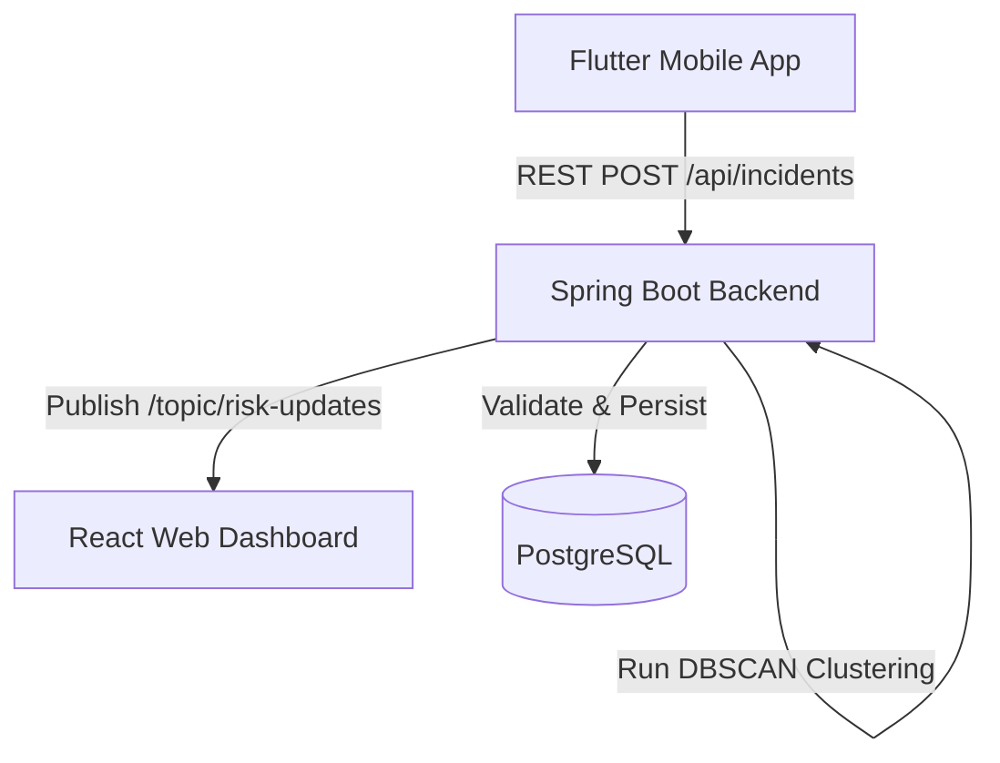

# Geo-Watch Master Technical & Functional Audit

> [!IMPORTANT]
> This is the definitive, code-verified audit of the Geo-Watch project. It supersedes all previous audits. Every claim in this document has been verified against the current source code, and unverified or missing features are explicitly noted.

---

## PART 1 — EXECUTIVE PROJECT OVERVIEW
Geo-Watch is an AI-powered crowd safety and real-time geospatial incident monitoring platform. It solves the problem of crowd safety at public events by allowing organizers to geofence an event area and monitor real-time distress signals (SOS) from participants. 
- **Target Users:** Event participants (via Mobile App) and Event Organizers (via Web Dashboard).
- **Core Workflow:** Participants report incidents with their GPS location. The backend validates the location against the geofence, calculates high-risk zones using a clustering algorithm, and broadcasts these zones in real-time to the organizer's dashboard map.
- **Main Differentiator:** A real-time, low-latency spatial clustering engine (DBSCAN) optimized for high concurrency.
- **Current Status:** The core event creation, SOS ingestion, spatial clustering, and real-time WebSocket broadcasting are fully functional and capable of handling up to 250 concurrent virtual users. Authentication is currently mocked/fake.

---

## PART 2 — COMPLETE SYSTEM ARCHITECTURE

- **Flutter Mobile App:** Handles user location acquisition and SOS API requests. Uses `Dio` for HTTP.
- **React Dashboard:** Vite + TypeScript + Leaflet. Provides UI for organizers and consumes real-time STOMP WebSockets for map updates.
- **Spring Boot Backend:** Java 21, Spring Web, Spring Data JPA, Spring WebSocket. Handles core logic, rate limiting, and DBSCAN clustering.
- **PostgreSQL Database:** Primary datastore containing Admin, Event, and Incident entities.

---

## PART 3 — REPOSITORY STRUCTURE
- `/GeoWatch - Application/`: Flutter mobile app source code.
  - `/lib/services/`: API and location services.
  - `/lib/models/`: Dart data models.
  - `/lib/screens/`: UI Views.
- `/GeoWatch - Frontend/`: React dashboard source code.
  - `/src/pages/`: React routes (AdminLogin, Dashboard, CreateEvent).
  - `/src/services/`: `api.ts` (axios) and `websocket.ts` (SockJS/Stomp).
- `/GeoWatch - Backend/`: Spring Boot Java backend.
  - `/src/main/java/com/safety/womensafety/controller/`: REST endpoints.
  - `/src/main/java/com/safety/womensafety/service/`: Core logic (IncidentService, DbscanClusteringService).
  - `/src/main/java/com/safety/womensafety/model/`: JPA Entities.
- `/benchmark/`: k6 load testing scripts and performance reports.

---

## PART 4 — MOBILE APPLICATION
### Screens
- **Splash, Auth, Registration, Settings:** Boilerplate UI flow.
- **Event Home / Events Screen:** Entry point for discovering nearby events.
- **Incident Report Screen:** Submits SOS.

### Location
Uses `location_service.dart`. Location is fetched during event discovery and at the exact moment of pressing the SOS button. There is NO continuous background location tracking verified in the source. 

### Event Discovery Flow
Location Fetched -> `ApiService.getNearbyEvents(lat, lng, radius)` -> `GET /api/events/nearby` -> Returns list of events -> Rendered in UI.

### SOS Flow
SOS Button Pressed -> Location Fetched -> `IncidentViewModel.submitIncident` -> `ApiService.submitIncident` -> `POST /api/incidents`.
- **Fields Submitted (`CreateIncidentRequest`):** `eventId`, `name`, `phoneNumber`, `latitude`, `longitude`.

| Method | Endpoint | Flutter File | Request | Response | Purpose |
|---|---|---|---|---|---|
| GET | `/api/events/nearby` | `api_service.dart` | `lat, lng, rad` | List of events | Find active events |
| POST | `/api/incidents` | `api_service.dart` | `CreateIncidentRequest` | Incident ID | Submit SOS |
| POST | `/api/incidents/{id}/resolve`| `api_service.dart` | None | String | Resolve incident |

---

## PART 5 — ADMIN WEB DASHBOARD
- **`AdminLogin` & `AdminRegister`:** Fake authentication forms. Calls `/api/admin/login` and `/api/admin/register`.
- **`Dashboard`:** Landing page for admins. Calls `GET /api/events/admin/active` to list active events.
- **`CreateEvent`:** Form to create events. Uses Nominatim (`https://nominatim.openstreetmap.org/search`) to geocode addresses. Submits to `POST /api/events`.
- **`AdminEvents`:** The core real-time map view. Uses Leaflet to draw geofence circles and heatmap layers. Connects to WebSocket topic `/topic/risk-updates/{eventId}` via `websocket.ts`.

---

## PART 6 — COMPLETE REST API REFERENCE

| Method | Endpoint | Controller | Method | Purpose | Auth | Request | Response | Status |
|---|---|---|---|---|---|---|---|---|
| POST | `/api/admin/register` | `AdminAuthController` | `register` | Register new admin | No | `AdminRegisterRequest` | `String` | 200 |
| POST | `/api/admin/login` | `AdminAuthController` | `login` | Login admin | No | `AdminLoginRequest` | `AdminLoginResponse` | 200, 500 |
| GET | `/api/admin/clusters/{eventId}` | `AdminController` | `getClustersByEventId` | Get clusters | No | Path `eventId` | `List<ClusterResponse>` | 200 |
| GET | `/api/admin/metrics` | `AdminController` | `getSystemMetrics` | Get system metrics | No | None | `Map<String, Object>` | 200 |
| POST | `/api/events` | `EventController` | `createEvent` | Create event | No | `CreateEventRequest` | `Event` | 200 |
| GET | `/api/events/nearby` | `EventController` | `getNearbyActiveEvents`| Find nearby events | No | `lat, lng, radius` | `List<NearbyEventResponse>` | 200 |
| GET | `/api/events/{eventId}` | `EventController` | `getEventDetails` | Get event details | No | Path `eventId` | `EventDetailsResponse` | 200 |
| GET | `/api/events/admin/active` | `EventController` | `getAllActiveEvents`| List active events | No | None | `List<Event>` | 200 |
| POST | `/api/incidents` | `IncidentController` | `submitIncident` | Report SOS incident | No | `CreateIncidentRequest`| `Long` | 200, 500 |
| POST | `/api/incidents/{id}/resolve`| `IncidentController` | `resolveIncident` | Mark resolved | No | Path `id` | `String` | 200, 500 |

---

## PART 8 — AUTHENTICATION & AUTHORIZATION
`AUTHENTICATION: NOT IMPLEMENTED`
- No JWT, no Spring Security, no password hashing, no protected routes.
- `POST /api/admin/login` compares plain-text passwords and returns the internal Database ID.
- Unauthenticated users CAN create events and resolve incidents.

---

## PART 9 — DATABASE & DATA MODEL
- **Technology:** PostgreSQL
- **Configuration:** Handled via Hibernate `spring.jpa.hibernate.ddl-auto=update`. Connection pooling via HikariCP (max 50).
- **Entities:**
  - `Admin`: `id`, `name`, `email`, `password`.
  - `Event`: `id`, `name`, `centerLat`, `centerLng`, `radius`, `startTime`, `endTime`, `admin` (ManyToOne).
  - `Incident`: `id`, `eventId`, `name`, `phoneNumber`, `latitude`, `longitude`, `timestamp`, `resolved`, `resolvedAt`.

---

## PART 10 — EVENT MANAGEMENT
React `CreateEvent` -> `POST /api/events` -> `EventController` -> `EventService` -> `EventRepository`.
- **Fields:** `name`, `centerLat`, `centerLng`, `radius`, `startTime`, `endTime`, `adminId`.
- **Status:** Event is "active" if current server time is between `startTime` and `endTime`.

---

## PART 11 — GEOFENCING
- **Implementation:** `GeoUtil.calculateDistance(lat1, lon1, lat2, lon2)` using Haversine formula (Earth radius 6371000m).
- **Validation Rule:** Located in `IncidentService.submitIncident`. The exact rule is `distance > event.getRadius() + 30`. If true, throws RuntimeException("Incident outside event geofence").

---

## PART 12 — INCIDENT/SOS SYSTEM
Flutter -> `POST /api/incidents` -> `IncidentController` -> `IncidentService.submitIncident` -> 
1. Validate event exists and is active.
2. Validate geofence.
3. Validate rate limit.
4. Save to PostgreSQL.
5. Call `triggerClusteringAndBroadcast`.
6. Return `incidentId`.

---

## PART 13 — RATE LIMITING
- **Mechanism:** Database query.
- **Rule:** Max 3 reports per 5 minutes per `phoneNumber`.
- **Query:** `incidentRepository.findByPhoneNumberAndTimestampAfter(phoneNumber, now - 5 mins)`. If `.size() >= 3`, throws RuntimeException.
- **Safety:** Because it queries the central database, it is completely safe for multi-instance backend environments.

---

## PART 14 — DBSCAN CLUSTERING ENGINE
- **Class:** `DbscanClusteringService`
- **Parameters:** `EPS = 50.0`, `MIN_PTS = 2`.
- **Algorithm:** Uses a grid-based `SpatialIndex` to bucket incidents into grid squares, filtering out N^2 comparisons.
- **Performance:** This spatial index drastically reduces comparisons, behaving much closer to O(N) than naive O(N^2).
- **Hardcoded Limitation:** The longitudinal bounding box conversion `(eps / (111320.0 * Math.cos(Math.toRadians(12.9716))))` assumes the event is at the latitude of **Bangalore, India** (`12.9716`).

---

## PART 15 — RISK ENGINE
Risk classification relies **strictly on incident count** within a cluster:
- **HIGH:** `>= 6` incidents
- **MEDIUM:** `>= 3` incidents
- **LOW:** `< 3` incidents

---

## PART 16 — ASYNCHRONOUS PROCESSING
- **Executor:** `Executors.newScheduledThreadPool(1)`
- **Mechanism:** `ConcurrentHashMap<Long, ScheduledFuture<?>> pendingTasks`.
- **Debounce Time:** 100 milliseconds.
- **Behavior:** 
  - If SOS 1 arrives: Task scheduled for 100ms.
  - If SOS 2 arrives 20ms later (same event): Ignored (debounced).
  - If SOS 3 arrives 150ms later: Task scheduled for 100ms.
- **Limitation:** Since it is a 1-thread pool, if multiple different events trigger clustering simultaneously, they will queue up sequentially. 

---

## PART 17 — WEBSOCKET / REAL-TIME SYSTEM
- **Config:** `WebSocketConfig` enables SimpleBroker.
- **Endpoint:** `/ws` (with SockJS fallback).
- **Topic:** `/topic/risk-updates/{eventId}`.
- **Payload:** Array of `ClusterResponse` (centerLat, centerLng, incidentCount, riskLevel).
- **Flow:** DBSCAN output -> `SimpMessagingTemplate.convertAndSend` -> React `websocket.ts` -> Leaflet re-render.

---

## PART 19 — INCIDENT RESOLUTION
- Admin clicks Resolve -> `POST /api/incidents/{id}/resolve` -> `IncidentService.resolveIncident` -> Sets `resolved = true` and `resolvedAt = now()` -> Saves to DB -> **Triggers `triggerClusteringAndBroadcast(eventId)`**. (Yes, resolving recalculates clusters).

---

## PART 20 — ERROR HANDLING
- **Backend:** `GlobalExceptionHandler` annotated with `@RestControllerAdvice`. It handles `RuntimeException` and returns 500 status codes with the exception message as string body.
- **Mobile/React:** Basic error alerts/snackbars displaying the string response from the backend.

---

## PART 21 — DEPLOYMENT
- **Frontend Hosting:** Cloudflare Pages (indicated by `https://geo-watch.pages.dev` in CORS config).
- **Backend/DB Hosting:** Railway (indicated by benchmark reports).
- **Environment Variables:** `DB_URL`, `PGUSER`, `PGPASSWORD`, `PORT`, `ALLOWED_ORIGINS`.

---

## PART 22 — EXTERNAL SERVICES
- **Nominatim (`openstreetmap.org`):** Used by React dashboard to convert address search strings into Lat/Lng. Required for event creation UX.
- **Leaflet:** Frontend Map renderer.

---

## PART 23 — PERFORMANCE & LOAD TESTING
*All data from `GeoWatch_Scalability_Performance_Validation_Report.md`*
- **REST PEAK STABLE (MEASURED):** 250 VUs, 732.99 req/sec, 397ms P95 latency, 0% errors.
- **REST MAX LIMIT (MEASURED):** 500 VUs, 754.56 req/sec, 1400ms P95 latency, 0.006% error rate.
- **WEBSOCKET (MEASURED):** 500 concurrent clients, 100% delivery, 0 loss.
- **CLUSTERING (MEASURED):** 0.92 ms server-side clustering latency.
- **END-TO-END (MEASURED):** 1,005.73 ms client-perceived latency.

---

## PART 24 — VERIFIED IMPLEMENTATION STATUS
### VERIFIED IMPLEMENTED
- Event creation, listing, querying.
- SOS reporting, rate-limiting, and geofence validation.
- Real-time debounced DBSCAN clustering.
- Real-time STOMP WebSocket broadcasting.

### HARDCODED / MOCKED
- **Authentication:** Admin login is completely fake.
- **Spatial Indexing:** Hardcoded to Bangalore's latitude (12.9716).

---

## PART 25 — CURRENT TECHNICAL LIMITATIONS
- **No Authentication:** API endpoints are exposed.
- **In-Memory SimpleBroker:** WebSockets will not scale horizontally across multiple JVM instances.
- **In-Memory Debounce Schedule:** `ConcurrentHashMap` debounce is local to the JVM. Multi-instance deployments would calculate clusters redundantly.
- **Single-Thread Executor:** High volume across *different* events will cause a queue backup in the clustering engine.

---

## PART 26 — SECURITY STATUS
**CRITICAL.** 
- No Spring Security. 
- Passwords stored in plain text.
- No authorization checks on any API endpoint. 
- Anyone can POST to `/api/events` or `/api/incidents/{id}/resolve`.

---

## PART 29 — CRITICAL END-TO-END TRACE (REAL-TIME RISK UPDATE)
1. **Trigger:** `IncidentController` receives `POST /api/incidents`.
2. **Persistence:** `IncidentService` saves the incident.
3. **Debounce:** `IncidentService.triggerClusteringAndBroadcast` schedules a 100ms task.
4. **Fetch:** Executor pulls unresolved incidents for the event from the last 15 minutes.
5. **Cluster:** `DbscanClusteringService` creates a grid, calculates clusters, determines risk (Low/Med/High).
6. **Broadcast:** `SimpMessagingTemplate` sends payload to `/topic/risk-updates/{eventId}`.
7. **Client Receive:** React's `websocket.ts` receives payload.
8. **Render:** React state updates, Leaflet heatmap overlays redraw the new high-risk zone.

---

## PART 30 — MASTER QUICK REFERENCE

| Category       | Current Implementation |
| -------------- | ---------------------- |
| Mobile         | Flutter, Dio |
| Frontend       | React, Vite, Leaflet, Axios |
| Backend        | Spring Boot 3, Java 21 |
| Database       | PostgreSQL 18, Spring Data JPA |
| Authentication | `NOT IMPLEMENTED` (Fake plain-text login) |
| REST           | Fully functional endpoints |
| WebSocket      | SockJS + STOMP (SimpleBroker) |
| Geofencing     | Haversine + 30m buffer |
| Rate Limiting  | DB-backed (3 reports / 5 mins / Phone) |
| Clustering     | Grid-Optimized DBSCAN (EPS=50, MIN_PTS=2) |
| Risk Engine    | Low(<3), Med(3-5), High(6+) |
| Deployment     | Cloudflare Pages (FE), Railway (BE/DB) |
